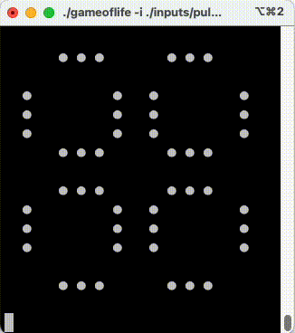

# gameoflife

[](https://github.com/ermanimer/gameoflife/actions/workflows/go.yml)
[](https://goreportcard.com/report/github.com/ermanimer/gameoflife)

Implementation of [Conway's Game of Life](https://en.wikipedia.org/wiki/Conway%27s_Game_of_Life) in Go.

*Works only on Unix-like systems.*

# Instalation

```zsh
go install github.com/ermanimer/gameoflife@latest
```

# Help

```zsh
gameoflife -h
```

# Sample Usage

Run gameoflife with input filename **./inputs/pulsar.txt** and with **2 fps** playback speed.

```zsh
gameoflife -i ./inputs/pulsar.txt -s 2
```

# Sample Output


